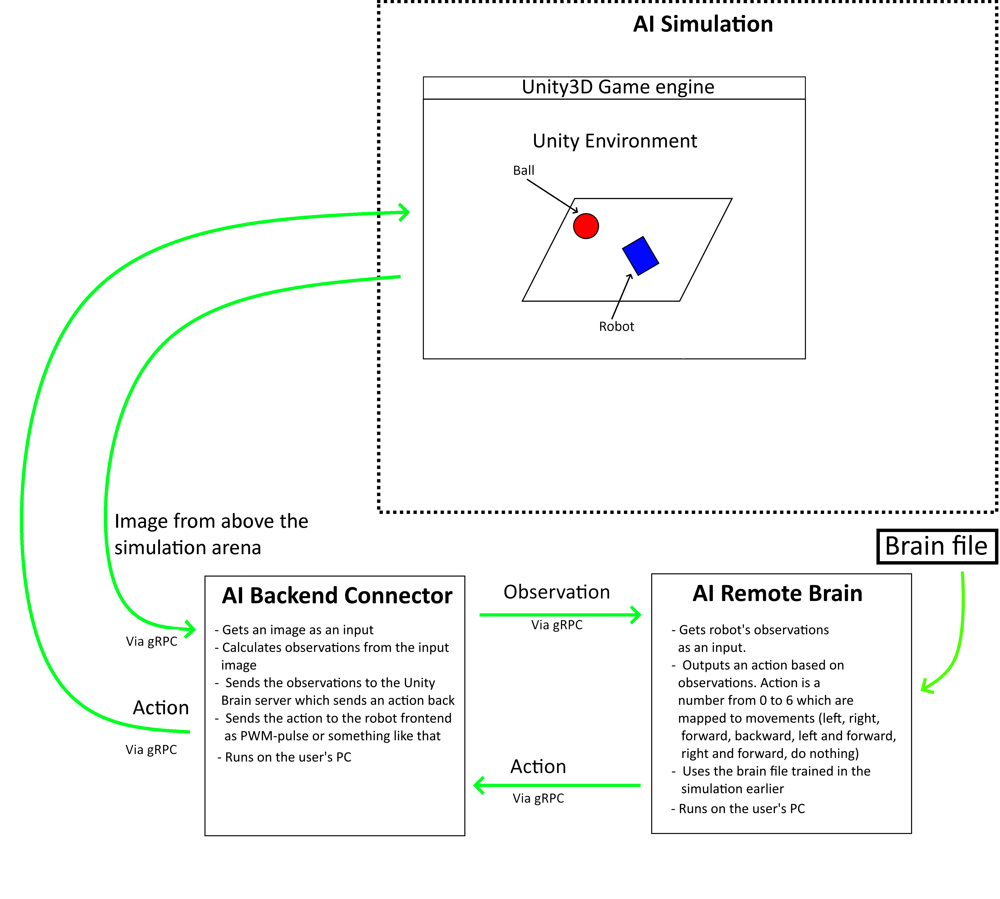

# Driving simulation with AI Backend Connector
This document shows how to drive the simulation with the AI Backend Connector and test that the AI Backend Connector works.

At this point your simulation should be able to run and you should be able to train your agents.

## Use AI Simulator to test AI Backend Connector

1. Use the AI Simulator to train a brain file.
1. Make the `move-brainfile-to-AIRemoteBrain.sh` script executable with `chmod +x move-brainfile-to-AIRemoteBrain.sh`
1. Execute `./move-brainfile-to-AIRemoteBrain.sh` to move a brain file to AI Remote Brain.
1. Start the AI Remote Brain-project in Unity and load the `AIRemoteBrain`-scene.
1. Press 'Play'-button in AI Remote Brain Unity window.
1. Load the scene `AIBackendConnectorTest`. This scene sends an image to the AI Backend Connector when requested. The AI Backend Connector creates observations from the image and sends the observations to the AI Remote Brain which predicts an action and sends it back to AI Backend Connector which send it back to AI Simulator.
1. Press 'Play'-button in AI Simulator Unity window.
1. Start AI Backend Connector's main Python script.

## System architecture

